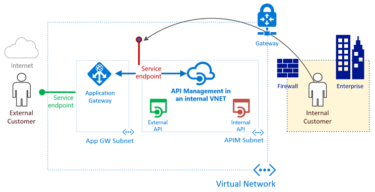

**Integrate API Management in an internal VNET with Application Gateway**

# Scenario
To deploy APIM with API gateway against a vnet so that it is not externally accessible and is secured with ddos and other protections 

# Deployment
This PowerShell script deploys - 

- Azure Application Gateway
- Azure API Management in Internal VNET mode

Any API's hosted will have a base URL https://api.example.org.
